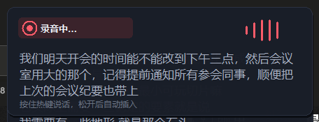

# Typeless but Free

English · [中文](README.zh-CN.md)

**Local, private, hold‑to‑talk voice dictation with AI cleanup — for Windows.**
*Like Typeless — but free & open source.*



Hold a hotkey, talk, release. Your speech is transcribed **on your own machine**
(faster‑whisper / CUDA), optionally cleaned up by an LLM (filler‑word removal,
punctuation, light rewriting), and pasted straight into wherever your cursor is.
A small floating card shows the transcription **live as you speak**.

> Voice never leaves your machine for transcription. Only the (already‑transcribed)
> text is sent to the cleanup LLM — and you can turn cleanup off entirely for 100% local.

```
Hold ALT+V → speak → release → local Whisper → (optional) LLM cleanup
            → text auto‑pasted at your cursor
```

## Features

- **Local STT** — `faster-whisper` on your GPU (CUDA) or CPU. No audio leaves your box.
- **Live preview** — see the transcription grow in real time while you talk.
- **AI cleanup (optional)** — any OpenAI‑compatible endpoint (DeepSeek, OpenAI, a local LLM…). Bring your own key, or turn it off.
- **Auto‑insert** — pastes into the focused window; no copy‑paste dance.
- **Learns from your fixes** — click the lingering card to correct a word; it remembers the fix (replacement rule + adds the term to hotwords) so it gets it right next time. 100% local.
- **Configurable hotkey** — hold‑to‑talk, double‑tap toggle, single key or chord (e.g. `alt+v`, `ctrl_r`, `caps_lock`).
- **Pure Python + tkinter** UI — dark, rounded, animated waveform that reacts to your mic volume.

## Requirements

- Windows 10/11
- Python 3.10+
- (Recommended) an NVIDIA GPU for fast transcription. **No GPU? It falls back to CPU automatically** (slower).

## Install

```powershell
git clone <your-repo-url> voicetype
cd voicetype
powershell -ExecutionPolicy Bypass -File .\setup.ps1
```

`setup.ps1` creates a venv, installs deps, and removes `hf-xet` (see Troubleshooting).
First run downloads the Whisper model (`large-v3-turbo` ≈ 1.6 GB) once.

## Configure

Copy the example and fill in your own values:

```powershell
copy config.example.json config.json
```

`config.json` is **git‑ignored** — your key stays local.

To enable AI cleanup, set **one** of:
- `llm_api_key` in `config.json`, or
- env var `LLM_API_KEY` / `DEEPSEEK_API_KEY` / `OPENAI_API_KEY`, or
- `llm_api_key_file` pointing to a `.env` file containing one of those vars.

**Want 100% local / no key?** Set `"cleanup_enabled": false`. You’ll get the raw
transcript inserted directly (keeps filler words, but nothing leaves your machine).

### Config reference

| key | default | meaning |
|---|---|---|
| `hotkey` | `alt+v` | trigger key/chord: `alt+v`, `ctrl_r`, `caps_lock`, `f8`, … |
| `hotkey_mode` | `hold` | `hold` = push‑to‑talk; `double_tap` = tap to start / tap to stop |
| `whisper_model` | `large-v3-turbo` | `large-v3` (most accurate) · `large-v3-turbo` (≈2× faster, ~same) · `medium`/`small`/`tiny` (faster, less accurate) |
| `whisper_device` | `auto` | `auto` / `cuda` / `cpu` (`auto`+`cuda` fall back to CPU if no GPU) |
| `language` | `null` | auto‑detect; set `"zh"` / `"en"` to lock |
| `simplify_chinese` | `true` | convert Traditional → Simplified on the Chinese path (Whisper sometimes drifts to Traditional); set `false` if you want Traditional |
| `beam_size` | `1` | `1` fastest; raise to `5` for marginally better accuracy |
| `cleanup_enabled` | `true` | LLM cleanup on/off (off = raw transcript, no key needed) |
| `confirm_before_insert` | `false` | `true` = show an editable popup before inserting |
| `streaming_partial` | `true` | live transcription while recording |
| `linger_ms` | `4000` | how long the bottom‑right card stays after inserting — click it within this window to fix/teach a word |
| `max_display_lines` | `4` | cap the card to N lines (older text scrolls off the top) |
| `vocabulary` | `[]` | terms to recognize more reliably, e.g. `["CLAUDE.md","agent"]` (also editable in the settings UI) |
| `insert_suffix` | `""` | text appended after each insert (`" "` space / `"\n"` newline; avoid newline in chat apps) |
| `restore_clipboard` | `true` | restore your previous clipboard after inserting |
| `max_record_seconds` | `120` | auto‑stop recording after N seconds (0 = no limit) |
| `paste_delay_ms` | `120` | focus/paste delay; raise if a slow app drops the paste |
| `llm_timeout_seconds` | `30` | cleanup request timeout |
| `llm_base_url` | `https://api.deepseek.com` | any OpenAI‑compatible base URL |
| `llm_model` | `deepseek-v4-flash` | model name on that endpoint |
| `hf_endpoint` | `https://huggingface.co` | model download host — **set to `https://hf-mirror.com` in mainland China** |
| `model_use_proxy` | `false` | `false` = bypass system proxy when downloading models |

## Usage

```powershell
.\run.bat
```

Hold **Alt+V**, speak, release. Watch the bottom‑right card. Done.
Close the window or press Ctrl+C to quit.

## Troubleshooting

Hard‑won notes (these cost a few hours to figure out — so you don't have to):

- **Model `config.json` / tokenizer downloads as 0 bytes / "JSON parse error"** → the
  `hf-xet` backend mangles small files on some networks/mirrors. `setup.ps1` uninstalls it;
  if you reinstalled it, run `pip uninstall -y hf-xet`.
- **`cublas64_12.dll cannot be loaded`** → CUDA runtime is missing. Ensure
  `nvidia-cublas-cu12`, `nvidia-cuda-runtime-cu12`, `nvidia-cudnn-cu12` are installed
  (they're in `requirements.txt`).
- **Downloads reset / `Connection aborted` behind a VPN (Clash etc.)** → the proxy is
  killing the connection. Keep `model_use_proxy: false` (default) so downloads bypass the proxy.
- **In mainland China** → set `hf_endpoint` to `https://hf-mirror.com`.
- **Hotkey does nothing** → run `run.bat` from your own desktop session (a global keyboard
  hook needs an interactive session).

## How it works

1. Global hotkey listener (`pynput`) detects hold/release.
2. `sounddevice` records mic audio to memory; RMS drives the waveform.
3. `faster-whisper` transcribes — every ~0.6 s on the partial audio for the live preview,
   then a final pass on release. The previous utterance is fed as `initial_prompt` for continuity.
4. Optional cleanup via an OpenAI‑compatible chat endpoint.
5. Clipboard + simulated Ctrl+V inserts into the focused window.

## Privacy

Audio is transcribed locally and never uploaded. With `cleanup_enabled: false`, nothing
leaves your machine at all. With cleanup on, only the transcribed **text** is sent to your
chosen LLM endpoint.

## Credits

Built on [faster-whisper](https://github.com/SYSTRAN/faster-whisper),
[CTranslate2](https://github.com/OpenNMT/CTranslate2),
[pynput](https://github.com/moses-palmer/pynput), and [sounddevice](https://github.com/spatialaudio/python-sounddevice).

## License

MIT — see [LICENSE](LICENSE).
